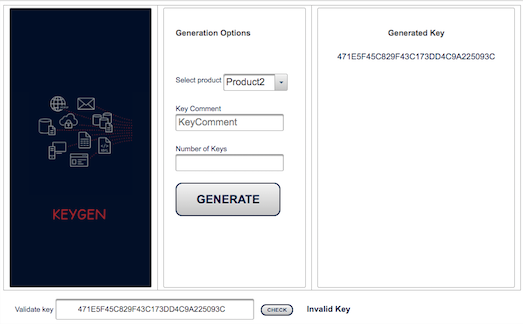
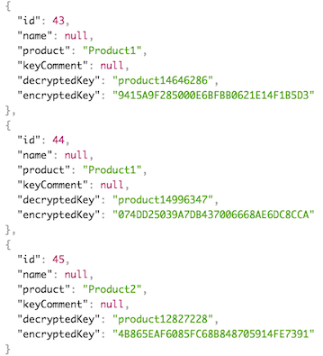

# AES-Key-Generator-in-Java 
Web Client to generate and validate keys.

- Web Client
- Simple RESTful Web Services is [here](https://github.com/AnastasiaVosswinkel/keygenservice) on GitHub   
	

# Web Services
##### Frameworks and Tools 
* JSF – Java EE
* Spring
* Spring Boot 

##### Database and Database Frameworks
* MySQL database server, JPA with Hibernate

##### Other Frameworks
* Primefaces – for the WebClient

* Also you need Eclipse EE (or IntelliJ Ultimate) and Eclipse Plugin: Spring Tools for Spring Boot in Marketplace

### Run
* Download the zip or clone the Git repository
* Open in Eclipse
* Right-click on project
* Run As > Spring Boot App. 
 

### KeyGenRestServise:

When the server is running, this service is accessible at this endpoint, which responds with a Database. 

	http://localhost:8089/licensekeys/
	

To generate a Key the service encrypt the "selected product name" + int "Random Number" with AES algorithm.

	Cipher cipher = Cipher.getInstance("AES");
			SecretKeySpec key = new SecretKeySpec(Const.M2KEY.getBytes(), "AES");
			cipher.init(Cipher.ENCRYPT_MODE, key);

* getAllKeys() -  to return all the Keys in the JSON
	
	http://localhost:8089/licensekeys
	

	
* getListByDecryptedKey() - to return you Key in the JSON

	http://localhost:8089/licensekeys/encryptedkey?licensekey=12BD348D447B90B0F57BDEB20A86C11D	
	
	
#### Test the Application:

Use The JUnit tests to generate some Keys. Than visit: 

	http://localhost:8089/licensekeys
	
where you should see the JSON, like this:

	{
	    "id": 43,
	    "name": null,
	    "product": "Product1",
	    "keyComment": null,
	    "decryptedKey": "product14646286",
	    "encryptedKey": "9415A9F285000E6BFBB0621E14F1B5D3"
	  },
	  {
	    "id": 44,
	    "name": null,
	    "product": "Product1",
	    "keyComment": null,
	    "decryptedKey": "product14996347",
	    "encryptedKey": "074DD25039A7DB437006668AE6DC8CCA"
	 },

### Classes:	

* LicenseKey.java, also used to generate the Table (@Entity, @Id, @GeneratedValue(strategy = GenerationType.IDENTITY))
		

	package com.example.demo.model;

	import java.io.Serializable;
	
	import javax.persistence.Entity;
	import javax.persistence.GeneratedValue;
	import javax.persistence.GenerationType;
	import javax.persistence.Id;
	
	
	@Entity
	public class LicenseKey implements Serializable{
		
		private static final long serialVersionUID = 1L;
		@Id
		@GeneratedValue(strategy = GenerationType.IDENTITY)
		private int id;
		private String name;
		private String product;
		private String keyComment;
		private String decryptedKey;
		private String encryptedKey;package com.example.demo.model;
	
	

* IKeyGenDao.java - interface

* KeyGenRestController.java
 
It has the @RestController annotation:

	@RequestMapping("/licensekeys")
		@RestController
		public class KeyGenRestController {
			@Autowired
			private IKeyGenService service;
	
		// http://localhost:8089/licensekeys
		@RequestMapping
		public List<LicenseKey> getAllKeys() {
			return service.getAll();
		}
		
		// http://localhost:8089/licensekeys/encryptedkey?licensekey=12BD348D447B90B0F57BDEB20A86C11D
		@GetMapping("/encryptedkey") //
		public LicenseKey getListByDecryptedKey(@RequestParam("licensekey") String encryptedKey ) {
			return service.getByEncryptedKey(encryptedKey);
		}
		
		@PostMapping("/generate")
		public LicenseKey newLicenseKey(@RequestBody LicenseKey lk) throws InvalidKeyException, NoSuchAlgorithmException, NoSuchPaddingException, IllegalBlockSizeException, BadPaddingException {
			return service.attachLicenseKey(lk);
		}

* IKeyGenService.java interface
	
* KeyGenService.java
	
	
	package com.example.demo.service;
	
	import java.security.InvalidKeyException;
	import java.security.NoSuchAlgorithmException;
	import java.util.List;
	import java.util.Random;
	
	import javax.crypto.BadPaddingException;
	import javax.crypto.Cipher;
	import javax.crypto.IllegalBlockSizeException;
	import javax.crypto.NoSuchPaddingException;
	import javax.crypto.spec.SecretKeySpec;
	
	import org.springframework.beans.factory.annotation.Autowired;
	import org.springframework.stereotype.Service;
	
	import com.example.demo.constant.Const;
	import com.example.demo.dao.IKeyGenDao;
	import com.example.demo.model.LicenseKey;
	@Service
	public class KeyGenService implements IKeyGenService {
		@Autowired 
		private IKeyGenDao dao;
		
	
		@Override
		public LicenseKey attachLicenseKey (LicenseKey lk) throws NoSuchAlgorithmException, NoSuchPaddingException, InvalidKeyException, IllegalBlockSizeException, BadPaddingException {
			
			// Encrypt Key using AES algorithm, hexadecimal and product information
			Random rand = new Random();
			int a = 1;
			int c = 9999999;
			int M2nummer = a + rand.nextInt(c - a + 1);
			String product =lk.getProduct();
			String decryptedKey = product + M2nummer;
	
			Cipher cipher = Cipher.getInstance("AES");
			SecretKeySpec key = new SecretKeySpec(Const.M2KEY.getBytes(), "AES");
			cipher.init(Cipher.ENCRYPT_MODE, key);
			byte[] bytes = cipher.doFinal(decryptedKey.getBytes());
			String encryptedKey = "";
			for (byte b : bytes) {
				System.out.println((char) b);
				encryptedKey = encryptedKey + String.format("%02X ", b);
				encryptedKey=encryptedKey.replaceAll("\\s+", "");
	
			}
	
			lk.setEncryptedKey(encryptedKey);
			lk.setDecryptedKey(decryptedKey);
			
			return dao.save(lk);
		}
	
		@Override
		public List<LicenseKey> getAll() {
			
			return dao.findAll();
		}
	
		@Override
		public LicenseKey getByEncryptedKey(String encryptedKey) {
			
			return dao.findByEncryptedKey(encryptedKey);
		}
	
	}

 
 

# Web Client

##### Frameworks and Tools 
* JSF – Java EE
* Spring
* Spring Boot 

##### Database and Database Frameworks
* MySQL database server, JPA with Hibernate

##### Other Frameworks
* Primefaces – for the WebClient

* Also you need Eclipse EE (or IntelliJ Ultimate) and Eclipse Plugin: Spring Tools for Spring Boot in Marketplace

### Run
* Download the zip or clone the Git repository
* Open in Eclipse
* Right-click on project
* Run As > Spring Boot App. 
 

#How to use Web Client:

Go to http://localhost:8088/Keygen.xhtml

* Choose the Product 
* Push "Generate". You should see the generated key like this: 471E5F45C829F43C173DD4C9A225093C.
* To validates the key or any other key push "Check".

### Classes Web Client:

 * Bean

	package com.example.demo.beans;

	
	import javax.faces.view.ViewScoped;
	import javax.inject.Named;
	
	import org.springframework.beans.factory.annotation.Autowired;
	
	import com.example.demo.model.LicenseKey;
	import com.example.demo.model.Product;
	import com.example.demo.service.KeyService;
	
	@ViewScoped
	@Named
	public class KeyGenBean {
		@Autowired
		private KeyService keyService;

	private LicenseKey licenseKey = new LicenseKey();
	private String selectedProduct;
	private String generatedKey = "";
	private String check = " ";
	String userKey;
	String keyComment;

	public void generate() {

		licenseKey = keyService.generateLicenseKey(selectedProduct, keyComment);
		generatedKey = licenseKey.getEncryptedKey();
		licenseKey.setKeyComment(check);

	}

	public void check() {

		check = keyService.validateSaidKey(userKey);

	}

	...
	

* KeyService to generate (PUT) and check (GET) the Keys on server. The Class has @Service.

	...
	
		RestTemplate template = new RestTemplate();
	
		// generateLicenseKey() creates a new License Key
	
		public LicenseKey generateLicenseKey(String product, String keyComment) {
	
			String url = "http://localhost:8089/licensekeys/generate";
	
			HttpHeaders headers = new HttpHeaders();
			headers.setContentType(MediaType.APPLICATION_JSON);
			headers.setAccept(Collections.singletonList(MediaType.APPLICATION_JSON));
			LicenseKey licenseKey = new LicenseKey();
	
			// create a map for post parameters
			Map<String, Object> map = new HashMap<String, Object>();
			map.put("product", product);
			map.put("keyComment", keyComment);
	
			HttpEntity<Map<String, Object>> entity = new HttpEntity<>(map, headers);
	
			ResponseEntity<LicenseKey> response = template.postForEntity(url, entity, LicenseKey.class);
	
			String URLres = "http://localhost:8089/licensekeys";
			ResponseEntity<LicenseKey[]> re = template.getForEntity(URLres, LicenseKey[].class);
	
			LicenseKey[] liArr = re.getBody();
			LicenseKey key = liArr[liArr.length - 1];
			String encryptedKey = key.getEncryptedKey();
			licenseKey.setEncryptedKey(encryptedKey);
			return licenseKey;
	
	
		}
	
		public String validateSaidKey(String userKey) {
			String text = ";";
	
			String URL = "http://localhost:8089/licensekeys/encryptedkey?licensekey=" + userKey;
			log.debug(">>>>>>>>URL: " + URL);
			try {
				ResponseEntity<LicenseKey> re = template.getForEntity(URL, LicenseKey.class);
				LicenseKey licenseKey = re.getBody();
				text = licenseKey.getEncryptedKey() + " Key Confirmed";
			} catch (Exception e) {
				text = "Invalid Key";
			}
			return text;
	
	
	
#####Keygen.xhtml with Primefaces:

	...
	<!-- http://localhost:8088/Keygen.xhtml -->
	<h:head>....
	
	

### Remarks
Features "Key Comment" and "Number of Keys" are not supported.
 

